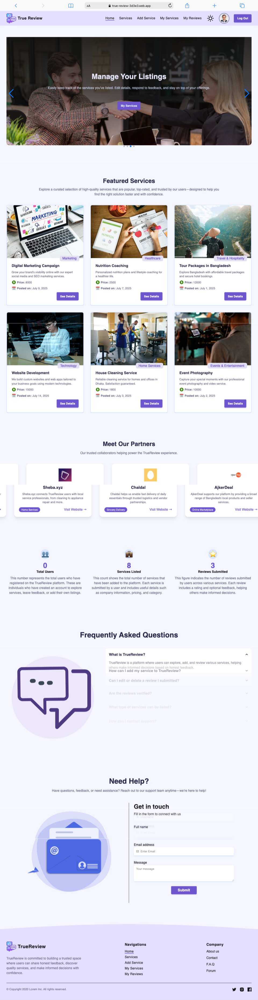

# ⭐TrueReview – Service Review System


**TrueReview** is a Service Review Application designed to let users discover, post, and review various services.

**Live Site:** [https://true-review-3d3e3.web.app](https://true-review-3d3e3.web.app)   
**Backend Site:** [https://true-review-server.vercel.app](https://true-review-server.vercel.app)


---

## 🚀 Features

- 🔐 **User Authentication** – Secure login and registration with Firebase Auth.
- 📝 **Service Management** – Authenticated users can add new services, edit service info, or delete them.
- 🌟 **Review System** – Logged-in users can post, update, or delete reviews for any service.
- 👤 **My Reviews Page** – View and manage all your submitted reviews in one place.
- 📄 **Service Details Page** – Explore ratings and textual feedback posted by the community.
- 🔍 **Protected Routes** – Pages like Add Service, My Services, and My Reviews are protected for logged-in users only.
- 📊 **Statistics Section** – Visual display of platform data (like total users or reviews).
- 🎨 **Modern UI** – Responsive and animated interface built with TailwindCSS and Framer Motion.
- ⚡ **Realtime Feedback** – Toast messages and SweetAlert confirmations for a smooth user experience.

---


## 📸 Screenshot



---

## Project Overview

**TrueReview** is a Service Review Application designed to let users discover, post, and review various services. It offers a seamless and interactive experience for users to share their opinions, manage services, and engage with reviews in a secure environment. Built with modern web technologies, TrueReview emphasizes real-time data handling, user authentication, and clean UI/UX design.
The goal of this project is to develop a real-world service review platform that allows users to:

- Add, update, and delete services
- Post detailed reviews with ratings
- Manage their personal review contributions
- Explore service details and community feedback

This project provides practical experience in full-stack development, integrating Firebase for authentication, and building RESTful APIs for backend communication.


---
## 🧰 Tech Stack

### 🔹 Frontend
- **React 19**
- **React Router 7**
- **Tailwind CSS 4**
- **Firebase Authentication**
- **Vite** for fast builds
- **Axios** for API calls

### 🔹 Backend
- **Express 5**
- **MongoDB**
- **Firebase Admin SDK** – For verifying ID tokens securely.
- **dotenv** – For managing environment variables.
- **CORS** – To handle cross-origin resource sharing.

---

## 📦 Client-Side Dependencies

```json
{
  "@emotion/react": "^11.14.0",
  "@emotion/styled": "^11.14.1",
  "@smastrom/react-rating": "^1.5.0",
  "@tailwindcss/vite": "^4.1.11",
  "aos": "^2.3.4",
  "axios": "^1.10.0",
  "firebase": "^11.10.0",
  "framer-motion": "^12.23.6",
  "hamburger-react": "^2.5.2",
  "lottie-react": "^2.4.1",
  "motion": "^12.23.5",
  "next-themes": "^0.4.6",
  "react": "^19.1.0",
  "react-countup": "^6.5.3",
  "react-dom": "^19.1.0",
  "react-fast-marquee": "^1.6.5",
  "react-helmet-async": "^2.0.5",
  "react-icons": "^5.5.0",
  "react-router": "^7.6.3",
  "react-spinners": "^0.17.0",
  "react-toastify": "^11.0.5",
  "sweetalert2": "^11.22.2",
  "swiper": "^11.2.10",
  "tailwindcss": "^4.1.11"
}
```

### **Backend**
- `express`
- `mongodb`
- `cors`
- `dotenv`
- `firebase-admin`

---

## ⚙️ Environment Variables

Create `.env` files in both **client** and **server** directories.

### **server/.env.example**
```env
PORT=5000
MONGODB_URI=your_mongodb_connection_string
STRIPE_SECRET_KEY=sk_test_...
FIREBASE_SERVICE_ACCOUNT_JSON=./serviceAccountKey.json
IMAGEBB_API_KEY=your_imagebb_key
````

### **client/.env.example**

```env
VITE_FIREBASE_API_KEY=...
VITE_FIREBASE_AUTH_DOMAIN=...
VITE_FIREBASE_PROJECT_ID=...
VITE_FIREBASE_STORAGE_BUCKET=...
VITE_FIREBASE_MESSAGING_SENDER_ID=...
VITE_FIREBASE_APP_ID=...
VITE_STRIPE_PUBLISHABLE_KEY=pk_test_...
```

---

## ▶️ Run Locally

1. **Clone the repository**

```bash
git clone https://github.com/<your-username>/<repo-name>.git
cd <repo-name>
```

2. **Setup Backend**

```bash
cd server
cp .env.example .env
# Fill in your environment variables
npm install
npm run dev
```

3. **Setup Frontend**

```bash
cd ../client
cp .env.example .env
# Fill in your environment variables
npm install
npm run dev
```

4. **Access the app**

* Frontend: [http://localhost:5173](http://localhost:5173) (Vite) or [http://localhost:3000](http://localhost:3000) (CRA)
* Backend API: [http://localhost:5000](http://localhost:5000)

---


## 🧪 Troubleshooting

* **MongoDB connection error** → Check `MONGODB_URI` and whitelist IPs on MongoDB Atlas.
* **Stripe payment failing** → Ensure you’re using **test API keys** and correct webhook setup.
* **Firebase auth error** → Verify your Firebase credentials and domain whitelist.
* **CORS errors** → Check backend CORS settings.

---

## 🌐 Live Links

* **Frontend:** [https://red--aid.web.app/](https://red--aid.web.app/)
* **Backend:** [https://redaid-server.vercel.app/](https://redaid-server.vercel.app/)

---

## 📜 License

This project is licensed under the **MIT License** — feel free to use and adapt it.


Here’s what you’ll still need to do before committing it:
1. **Replace** `./assets/banner.png` and `./assets/screenshot.png` with actual files in your repo.  
2. Add real environment variables in `.env` (not committed).  
3. Update `<your-username>` and `<repo-name>` in the clone URL.  

---

## ⚙️ Environment Variables

Create `.env` files in both client and server folders.

### server/.env.example

```env
PORT=5000
MONGODB_URI=your_mongodb_connection_string
FIREBASE_SERVICE_ACCOUNT_JSON=./serviceAccountKey.json
```

### client/.env.example

```env
VITE_FIREBASE_API_KEY=...
VITE_FIREBASE_AUTH_DOMAIN=...
VITE_FIREBASE_PROJECT_ID=...
VITE_FIREBASE_STORAGE_BUCKET=...
VITE_FIREBASE_MESSAGING_SENDER_ID=...
VITE_FIREBASE_APP_ID=...
```

---

## ▶️ Run Locally

1. **Clone repository**

```bash
git clone https://github.com/<your-username>/<repo-name>.git
cd <repo-name>
```

2. **Setup Backend**

```bash
cd server
cp .env.example .env
# Fill in environment variables
npm install
npm run dev
```

3. **Setup Frontend**

```bash
cd ../client
cp .env.example .env
# Fill in environment variables
npm install
npm run dev
```

4. **Access app**

* Frontend: [http://localhost:5173](http://localhost:5173) (Vite)
* Backend API: [http://localhost:5000](http://localhost:5000)

---

## 🧪 Troubleshooting

* **MongoDB Connection Error:** Verify `MONGODB_URI` and network access on Atlas
* **Firebase Authentication Issues:** Check Firebase config and domain whitelist
* **CORS Errors:** Confirm backend CORS settings
* **Server Startup Fails:** Verify environment variables and dependencies

---

## 🌐 Live Links

* Frontend: [https://true-review-3d3e3.web.app](https://true-review-3d3e3.web.app)
* Backend: [https://true-review-server.vercel.app](https://true-review-server.vercel.app)

---

## 📜 License

Licensed under the **MIT License** – feel free to use and adapt.

---

Let me know if you want me to generate this in markdown file format or add anything else!